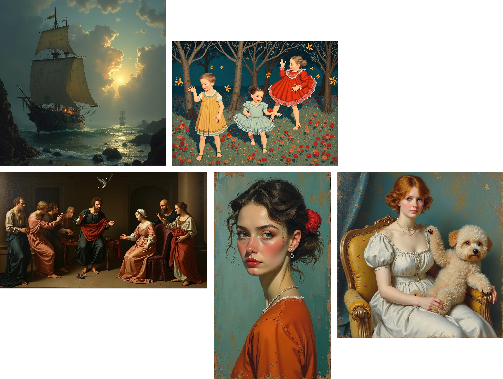
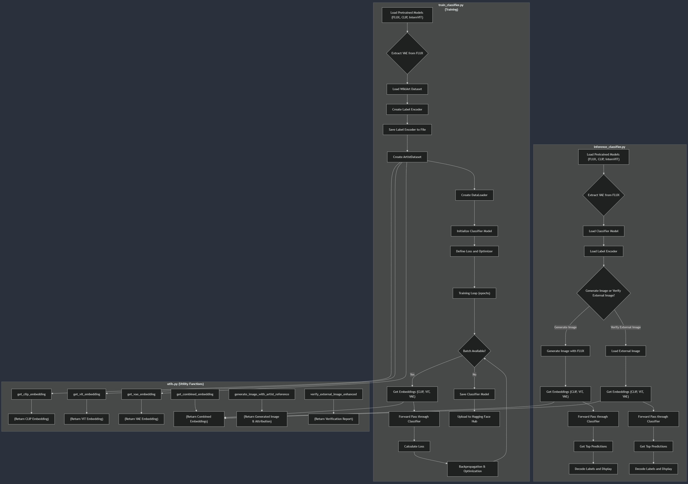

---

# Lawful Diffusion

This implementation provides a comprehensive framework for integrating **Stable Diffusion** with a **retrieval-based attribution system** using **PyTorch**, **Hugging Face's Diffusers**, and **CLIP**. By encoding and indexing the training dataset's images, the system can both attribute generated images and verify external images against the training data.

This approach promotes transparency and accountability in generative models, addressing concerns related to copyright and artist attribution. It serves as a foundation that can be further refined and expanded based on specific requirements and datasets.

---

## Goals

Building a sophisticated generative model architecture that integrates **Stable Diffusion** with a **retrieval-based attribution system** involves several components. This system will not only generate images based on text prompts but also provide attributions to the artists or data sources that most closely align with the generated content. Additionally, it will offer verification capabilities for external images against the training dataset.

---

A **training pipeline** that allows a generative model like **Stable Diffusion** to **output the nearest artist reference text based on both CLIP embeddings and autoencoder (VAE) embeddings** involves the following key steps:

1. **Data Preparation**: Organize dataset with images and associated artist labels.
2. **Embedding Extraction**:
   - **CLIP Embeddings**: Encode images using the CLIP model.
   - **Autoencoder (VAE) Embeddings**: Extract latent representations from the VAE part of the Stable Diffusion model.
3. **Combining Embeddings**: Merge CLIP and VAE embeddings to create a comprehensive representation.
4. **Label Encoding**: Encode artist labels for training.
5. **Model Training**: Train a classifier (e.g., a neural network) to predict artist labels based on combined embeddings.
6. **Integration with Generation Pipeline**: Enhance the image generation process to output artist references alongside generated images.

---

## Architecture Diagram

---

## Publication

- We published our early website and first article, kindly check out this article named [Bridging Generative AI and Artistic Integrity: A New Era of Creative Collaboration](https://lawfuldiffusion.kreasof.my.id/article/bridging-generative-ai-and-artistic-integrity)
- We publish brief video explanation regarding the project [[Link]](https://youtu.be/rL8eNZdQ7Y4?si=b2VhYLZKBTrNedWV)

---

## Future updates

- Experimental implementation with [WikiArt Public dataset](https://huggingface.co/datasets/huggan/wikiart)
- [FLUX.1-schnell](https://huggingface.co/black-forest-labs/FLUX.1-schnell) implementation rather than stable diffusion

---

## Important Notes

> We are looking for research sponsor/investor. Please email Akbar2habibullah@gmail.com if you are interested in sponsoring this project.
